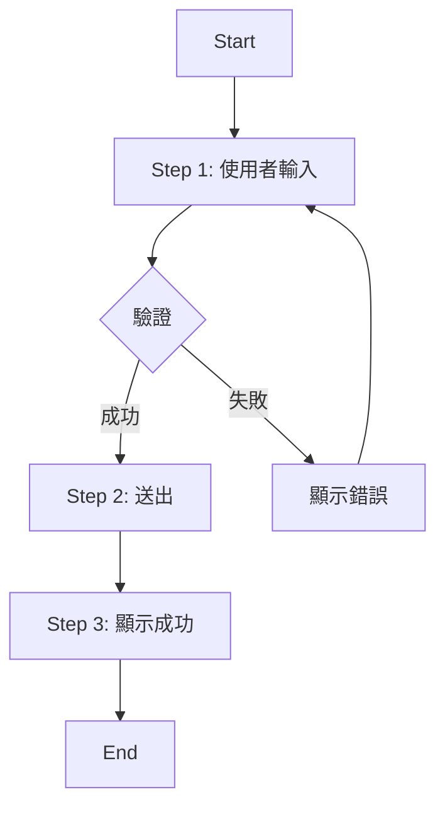

# Flow: [Flow Name]

**Flow ID**: [flow-###]
**Created**: [TIMESTAMP]
**Source**: spec.md - [Related User Stories]
**Status**: [Draft | Review | Approved]

---

## 📋 Overview

**Purpose**: [一句話描述這個流程的目的]

**User Goal**: [使用者想要達成什麼]

**Trigger**: [什麼情況下會觸發這個流程]

**Success Outcome**: [成功完成後的結果]

**Covered User Stories**:
- US[###]: [User Story 簡述]
- US[###]: [User Story 簡述]

---

## 👥 Actors

**Primary Actor**: [主要使用者角色，例如：已登入使用者、訪客]

**Secondary Actors** (如果適用):
- [系統角色 1，例如：Email Service]
- [系統角色 2，例如：Payment Gateway]

---

## 🎯 Prerequisites

**使用者狀態**:
- [例如：使用者必須已登入]
- [例如：使用者必須有有效的 email]

**系統狀態**:
- [例如：資料庫必須可用]
- [例如：Email 服務必須正常運作]

**資料要求**:
- [例如：使用者資料必須存在於系統中]

---

## 📖 Main Flow (Happy Path)

### Step 1: [步驟名稱]

**Actor**: [誰執行這個步驟]

**Action**: [使用者/系統做了什麼]
- [詳細描述動作]

**UI Element**: [相關的 UI 元件]
- Page: `[page-name]`
- Component: `[component-name]`
- Element: `[element-id]`

**System Action**: [系統的回應]
- [系統做了什麼]

**Data**: [涉及的資料]
```
Input:
  - [field1]: [value/type]
  - [field2]: [value/type]

Output:
  - [result1]: [value/type]
  - [result2]: [value/type]
```

**API Call** (如果適用):
- Endpoint: `[POST /api/resource]`
- Contract: See `visual-spec/contracts/[contract-file].yaml#[endpoint]`

**Next**: → Step 2

---

### Step 2: [步驟名稱]

**Actor**: [誰執行這個步驟]

**Action**: [使用者/系統做了什麼]
- [詳細描述動作]

**Validation**: [驗證規則]
- [驗證項目 1]
- [驗證項目 2]

**UI Element**: [相關的 UI 元件]
- Page: `[page-name]`
- Component: `[component-name]`

**System Action**: [系統的回應]
- [系統做了什麼]

**Next**: → Step 3

---

### Step 3: [步驟名稱]

**Actor**: [誰執行這個步驟]

**Action**: [使用者/系統做了什麼]

**UI Feedback**: [使用者看到什麼]
- Success message: "[確切的成功訊息]"
- UI update: [UI 如何改變]

**State Change**: [狀態改變]
- User state: [使用者狀態如何改變]
- System state: [系統狀態如何改變]

**Next**: → Flow complete

---

## ❌ Alternative Flows (Error Cases)

### Alt Flow 1: [錯誤情境名稱]

**Trigger**: [什麼情況會進入這個錯誤流程]

**Diverges at**: Step [X]

**Flow**:

#### Step 1a: [錯誤處理步驟]
**What Happened**: [發生了什麼錯誤]

**System Action**: [系統如何回應]
- [系統做了什麼]

**Error Message**: "[確切的錯誤訊息]"

**UI Feedback**: [使用者看到什麼]
- Error display location: [錯誤顯示在哪裡]
- Error styling: [錯誤如何呈現]

**User Options**: [使用者可以做什麼]
- Option 1: [重試]
- Option 2: [取消]

**Next**:
- If retry: → Return to Step [X]
- If cancel: → Flow aborted

---

### Alt Flow 2: [另一個錯誤情境]

**Trigger**: [什麼情況會進入這個錯誤流程]

**Diverges at**: Step [Y]

**Flow**:

#### Step 2a: [錯誤處理步驟]
[同上格式]

---

## 🔄 Edge Cases

### Edge Case 1: [邊界情況名稱]

**Scenario**: [描述邊界情況]

**Handling**: [如何處理]
- [處理方式]

**Expected Behavior**: [預期行為]
- [系統應該如何反應]

---

### Edge Case 2: [另一個邊界情況]

**Scenario**: [描述邊界情況]

**Handling**: [如何處理]

---

## 🎨 Flow Diagram

```
[可選：使用 ASCII art 或描述流程圖]

Start
  │
  ├─→ Step 1: [步驟名稱]
  │     │
  │     ├─→ Validation OK → Step 2
  │     │
  │     └─→ Validation Failed → Alt Flow 1
  │           │
  │           └─→ Show Error → Retry or Cancel
  │
  └─→ Step 2: [步驟名稱]
        │
        └─→ Success → End
```

Or use Mermaid:


---

## 📊 Metrics & Success Criteria

**Performance Requirements**:
- Step [X] must complete within [Y] seconds
- Total flow should complete within [Z] seconds

**Success Metrics**:
- [X]% of flows complete successfully
- [Y]% of users reach the end without errors

**Validation**:
- [ ] All steps have clear UI elements
- [ ] All error cases are handled
- [ ] All API calls have contracts defined
- [ ] All error messages are user-friendly

---

## 🔗 Related Specifications

**Pages**:
- `visual-spec/pages/[page-1].md`
- `visual-spec/pages/[page-2].md`

**API Contracts**:
- `visual-spec/contracts/[contract-1].yaml`
- `visual-spec/contracts/[contract-2].yaml`

**Other Flows**:
- `visual-spec/flows/[related-flow-1].md`
- `visual-spec/flows/[related-flow-2].md`

**User Stories**:
- spec.md#US[###]
- spec.md#US[###]

---

## 📝 Notes & Assumptions

**Assumptions**:
- [假設 1]
- [假設 2]

**Open Questions**:
- [ ] [問題 1]
- [ ] [問題 2]

**Design Decisions**:
- [決定 1]: [原因]
- [決定 2]: [原因]

---

## ✅ Review Checklist

Use this checklist when reviewing this flow:

- [ ] **Completeness**: All steps are defined
- [ ] **Error Handling**: All error cases are covered
- [ ] **UI Elements**: All UI elements are specified in page specs
- [ ] **API Contracts**: All API calls have contracts
- [ ] **Validation**: All validation rules are clear
- [ ] **Error Messages**: All error messages are user-friendly
- [ ] **Edge Cases**: All edge cases are handled
- [ ] **Performance**: Performance requirements are realistic
- [ ] **User Experience**: Flow is intuitive and user-friendly
- [ ] **Consistency**: Terminology is consistent with other specs

---

**Version**: 1.0
**Last Updated**: [TIMESTAMP]
**Reviewed By**: [Reviewer Name]
**Approved**: [Yes/No]
