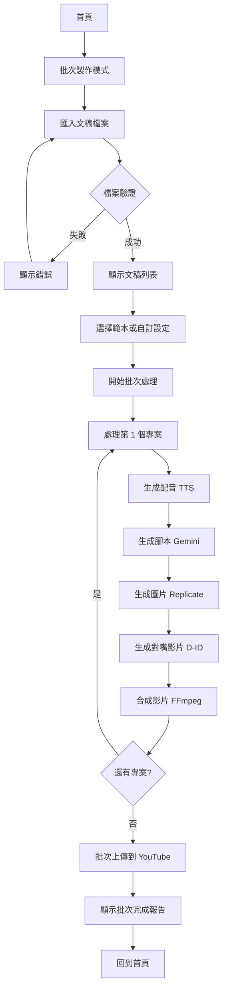

# 批次製作流程 (Batch Creation Flow)

## 流程概述

允許使用者一次匯入多個文稿,套用範本設定,序列處理並批次上傳到 YouTube。

**適用場景**:
- 製作系列影片 (例如:「Python 教學第 1-10 集」)
- 批次處理多個腳本
- 使用統一風格製作多部影片

## 流程圖



## 詳細流程

### 1. 啟動批次製作模式

**觸發位置**: 首頁

**入口**:
- 方式 1: 首頁快速動作新增「批次製作」按鈕
- 方式 2: 選單列 → 檔案 → 批次製作

**顯示對話框**:
```
┌─────────────────────────────────────────────────┐
│  批次製作                                    [✕] │
├─────────────────────────────────────────────────┤
│  一次匯入多個文稿,使用相同設定製作多部影片      │
│                                                 │
│  文稿檔案格式                                   │
│  ◉ 多個文字檔案 (.txt)                         │
│  ○ CSV 檔案 (標題, 文稿內容, 描述)             │
│  ○ JSON 檔案 (結構化批次設定)                  │
│                                                 │
├─────────────────────────────────────────────────┤
│                           [取消] [選擇檔案...]  │
└─────────────────────────────────────────────────┘
```

### 2. 匯入文稿檔案

**方式 1: 多個文字檔案**

1. **選擇多個 .txt 檔案**:
   - 開啟檔案選擇器
   - 允許多選: 是
   - 篩選: *.txt
   - 建議命名: `01-標題.txt`, `02-標題.txt` (自動排序)

2. **檔案結構**:
   ```
   檔名: 01-Python 教學-變數與型別.txt
   內容:
   今天我們要學習 Python 的變數與型別...
   (純文字內容,作為文稿)
   ```

3. **解析規則**:
   - 檔名去除編號後作為影片標題
   - 檔案內容作為文稿
   - 自動按檔名排序

**方式 2: CSV 檔案**

1. **選擇 CSV 檔案**:
   - 開啟檔案選擇器
   - 篩選: *.csv

2. **CSV 格式**:
   ```csv
   標題,文稿內容,描述,標籤
   "Python 教學 - 變數與型別","今天我們要學習...","這是第一集","Python,教學,程式設計"
   "Python 教學 - 條件判斷","接下來學習條件...","這是第二集","Python,教學,程式設計"
   ```

3. **欄位說明**:
   - 標題: 影片標題 (必填)
   - 文稿內容: 影片文稿 (必填)
   - 描述: YouTube 描述 (選填)
   - 標籤: 以逗號分隔 (選填)

**方式 3: JSON 檔案**

1. **選擇 JSON 檔案**:
   - 開啟檔案選擇器
   - 篩選: *.json

2. **JSON 格式**:
   ```json
   {
     "batchSettings": {
       "voiceId": "zh-TW-HsiaoChenNeural",
       "imageStyle": "realistic",
       "didSettings": {
         "enabled": false
       }
     },
     "videos": [
       {
         "title": "Python 教學 - 變數與型別",
         "script": "今天我們要學習...",
         "description": "這是第一集",
         "tags": ["Python", "教學", "程式設計"]
       },
       {
         "title": "Python 教學 - 條件判斷",
         "script": "接下來學習條件...",
         "description": "這是第二集",
         "tags": ["Python", "教學", "程式設計"]
       }
     ]
   }
   ```

### 3. 顯示文稿列表頁面

**頁面佈局**:
```
┌─────────────────────────────────────────────────────────────┐
│  批次製作                                     [儲存批次] [✕]  │
│  已匯入 5 個文稿,檢視並調整設定                              │
├─────────────────────────────────────────────────────────────┤
│  ┌────────────────────────────────────────────────────────┐ │
│  │  文稿列表 (5)                              [新增] [移除]│ │
│  ├────────────────────────────────────────────────────────┤ │
│  │  ☑ 1. Python 教學 - 變數與型別    (500 字 · 2 分鐘)   │ │
│  │  ☑ 2. Python 教學 - 條件判斷      (450 字 · 2 分鐘)   │ │
│  │  ☑ 3. Python 教學 - 迴圈          (600 字 · 2 分鐘)   │ │
│  │  ☑ 4. Python 教學 - 函式          (550 字 · 2 分鐘)   │ │
│  │  ☑ 5. Python 教學 - 模組          (480 字 · 2 分鐘)   │ │
│  └────────────────────────────────────────────────────────┘ │
│                                                               │
│  ┌────────────────────────────────────────────────────────┐ │
│  │  批次設定                                               │ │
│  ├────────────────────────────────────────────────────────┤ │
│  │  範本 ▼ [我的預設樣式]               [管理範本]        │ │
│  │                                                         │ │
│  │  或自訂設定:                                            │ │
│  │  語音: ▼ zh-TW-HsiaoChenNeural                         │ │
│  │  圖片風格: ◉ 真實攝影  ○ 可愛插畫  ○ 中國古典         │ │
│  │  D-ID 對嘴: ☐ 啟用                                     │ │
│  │  輸出位置: ~/Documents/YTMaker3/批次-Python教學        │ │
│  └────────────────────────────────────────────────────────┘ │
│                                                               │
│  ┌────────────────────────────────────────────────────────┐ │
│  │  YouTube 設定                                          │ │
│  ├────────────────────────────────────────────────────────┤ │
│  │  ☑ 批次上傳後自動上傳到 YouTube                        │ │
│  │  隱私設定: ◉ 公開  ○ 不公開  ○ 私人                   │ │
│  │  分類: ▼ 教育                                          │ │
│  │  描述範本:                                             │ │
│  │  ┌──────────────────────────────────────────────────┐ │ │
│  │  │ {description}                                      │ │ │
│  │  │                                                    │ │ │
│  │  │ 訂閱我的頻道以獲取更多教學影片!                    │ │ │
│  │  └──────────────────────────────────────────────────┘ │ │
│  └────────────────────────────────────────────────────────┘ │
│                                                               │
│  預估總時間: 約 50-60 分鐘  總費用: 約 $4.15                │
│                                          [取消] [開始製作 →] │
└─────────────────────────────────────────────────────────────┘
```

**文稿列表功能**:
- 勾選/取消勾選個別文稿
- 拖曳調整順序
- 點擊編輯個別文稿內容
- 移除不需要的文稿
- 手動新增文稿

**預估計算**:
- 總時間: (影片數量 × 平均處理時間) + 上傳時間
- 總費用: (Gemini + TTS + Replicate + D-ID) × 影片數量

### 4. 批次處理執行

**點擊「開始製作」按鈕後**:

**顯示批次處理視窗**:
```
┌──────────────────────────────────────────────────────────┐
│  批次製作進行中                             [最小化] [✕] │
├──────────────────────────────────────────────────────────┤
│  整體進度  ████████░░░░░░░░░░░░░░░░░░░░░░░░ 2/5 (40%)   │
│  預計剩餘時間: 30 分鐘                                   │
│                                                          │
│  ✓ 1. Python 教學 - 變數與型別  (已完成 · 2 分鐘前)     │
│  ✓ 2. Python 教學 - 條件判斷    (已完成 · 剛剛)         │
│  ● 3. Python 教學 - 迴圈        (處理中 · 65%)          │
│     └─ 正在生成圖片 (3/5)... (Replicate)                │
│  ○ 4. Python 教學 - 函式        (等待中)                │
│  ○ 5. Python 教學 - 模組        (等待中)                │
│                                                          │
│  [暫停批次] [查看日誌]                                   │
└──────────────────────────────────────────────────────────┘
```

**狀態圖示**:
- ✓: 已完成
- ●: 處理中
- ○: 等待中
- ✕: 失敗

**處理流程** (序列處理每個專案):
1. 建立專案目錄
2. 生成配音 (Google TTS)
3. 生成腳本 (Gemini)
4. 生成圖片 (Replicate,並行)
5. 生成對嘴影片 (D-ID,若啟用)
6. 合成影片 (FFmpeg)
7. 儲存專案檔案
8. 繼續下一個專案

**錯誤處理**:
- 若某個專案失敗,標記為失敗狀態
- 顯示錯誤訊息在該專案下方
- 繼續處理下一個專案
- 最後彙總成功/失敗數量

**暫停/繼續**:
- 點擊「暫停批次」暫停處理
- 完成目前正在處理的專案後停止
- 可點擊「繼續批次」恢復處理

### 5. 批次上傳到 YouTube

**處理完成後** (若啟用自動上傳):

**顯示批次上傳視窗**:
```
┌──────────────────────────────────────────────────────────┐
│  批次上傳到 YouTube                                  [✕] │
├──────────────────────────────────────────────────────────┤
│  整體進度  ████████████░░░░░░░░░░░░░░░ 3/5 (60%)        │
│                                                          │
│  ✓ 1. Python 教學 - 變數與型別  (已上傳)                │
│     └─ https://youtu.be/abc123                          │
│  ✓ 2. Python 教學 - 條件判斷    (已上傳)                │
│     └─ https://youtu.be/def456                          │
│  ● 3. Python 教學 - 迴圈        (上傳中 · 75%)          │
│     └─ 已上傳 150 MB / 200 MB                           │
│  ○ 4. Python 教學 - 函式        (等待中)                │
│  ○ 5. Python 教學 - 模組        (等待中)                │
│                                                          │
│  [暫停上傳] [查看已上傳]                                 │
└──────────────────────────────────────────────────────────┘
```

**上傳邏輯**:
- 序列上傳 (避免超出 API 配額)
- 每次上傳間隔 10 秒
- 自動重試失敗的上傳 (最多 3 次)
- 儲存 YouTube 影片 ID 和連結

### 6. 批次完成報告

**所有處理完成後**:

**顯示完成報告頁面**:
```
┌─────────────────────────────────────────────────────────────┐
│  批次製作完成                                     [儲存] [✕]  │
├─────────────────────────────────────────────────────────────┤
│                                                               │
│                      ✓ 批次製作完成                           │
│                                                               │
│  已成功製作並上傳 5 部影片                                    │
│                                                               │
│  ┌───────────────────────────────────────────────────────┐  │
│  │  製作摘要                                              │  │
│  ├───────────────────────────────────────────────────────┤  │
│  │  總影片數: 5                                           │  │
│  │  成功: 5  失敗: 0                                      │  │
│  │  總處理時間: 52 分鐘                                    │  │
│  │  平均每部: 10.4 分鐘                                   │  │
│  └───────────────────────────────────────────────────────┘  │
│                                                               │
│  ┌───────────────────────────────────────────────────────┐  │
│  │  已上傳影片                                            │  │
│  ├───────────────────────────────────────────────────────┤  │
│  │  ✓ 1. Python 教學 - 變數與型別                        │  │
│  │     https://youtu.be/abc123                           │  │
│  │  ✓ 2. Python 教學 - 條件判斷                          │  │
│  │     https://youtu.be/def456                           │  │
│  │  ✓ 3. Python 教學 - 迴圈                              │  │
│  │     https://youtu.be/ghi789                           │  │
│  │  ✓ 4. Python 教學 - 函式                              │  │
│  │     https://youtu.be/jkl012                           │  │
│  │  ✓ 5. Python 教學 - 模組                              │  │
│  │     https://youtu.be/mno345                           │  │
│  │                                                         │  │
│  │  [匯出連結清單] [建立播放清單]                         │  │
│  └───────────────────────────────────────────────────────┘  │
│                                                               │
│  ┌───────────────────────────────────────────────────────┐  │
│  │  API 用量統計                                          │  │
│  ├───────────────────────────────────────────────────────┤  │
│  │  Gemini:      5 次 · 總計 $0.10                       │  │
│  │  Google TTS:  5 次 · 總計 $0.05                       │  │
│  │  Replicate:  25 次 · 總計 $2.50                       │  │
│  │  D-ID:        0 次 · 總計 $0.00                       │  │
│  │  YouTube:     5 次 · 總計 免費                        │  │
│  │  ─────────────────────────────────────────────────────│  │
│  │  總計: $2.65                                           │  │
│  │                                                         │  │
│  │  [匯出 CSV]                                            │  │
│  └───────────────────────────────────────────────────────┘  │
│                                                               │
│                                   [回到首頁] [再次批次製作]  │
└─────────────────────────────────────────────────────────────┘
```

**匯出連結清單**:
- 匯出所有 YouTube 影片連結到文字檔
- 格式:
  ```
  1. Python 教學 - 變數與型別
     https://youtu.be/abc123

  2. Python 教學 - 條件判斷
     https://youtu.be/def456
  ...
  ```

**建立播放清單** (整合 YouTube API):
1. 點擊「建立播放清單」
2. 開啟播放清單命名對話框
3. 呼叫 YouTube API 建立播放清單
4. 將所有影片加入播放清單
5. 顯示播放清單連結

## 功能特點

### 1. 智慧排序
- 自動偵測檔名中的編號
- 支援格式: `01-`, `1.`, `第1集-`
- 允許手動拖曳調整順序

### 2. 範本系統整合
- 可選擇既有範本
- 批次套用統一設定
- 減少重複設定時間

### 3. 進度儲存
- 自動儲存批次進度
- 應用程式關閉後可恢復
- 失敗的專案可單獨重試

### 4. 彈性配置
- 可選擇是否自動上傳
- 可個別調整每個專案的設定
- 支援暫停/繼續

### 5. 錯誤復原
- 失敗的專案不影響其他專案
- 自動重試機制
- 詳細的錯誤日誌

## 鍵盤快捷鍵

```
Cmd+Shift+B: 開啟批次製作
Cmd+P: 暫停/繼續批次處理
Cmd+L: 查看處理日誌
Esc: 取消批次製作 (需確認)
```

## 無障礙

- 批次進度提供語音通知
- 完成時顯示系統通知
- 所有控制項支援鍵盤操作
- 處理日誌可匯出為文字
