# 主要影片製作流程 (Main Video Creation Flow)

## 流程概述

從文稿輸入到 YouTube 上傳的完整流程,涵蓋所有必要步驟和決策點。

## 流程圖

```mermaid
flowchart TD
    Start([使用者開啟應用程式]) --> CheckAPI{檢查<br/>API 金鑰}

    CheckAPI -->|未設定| Welcome[顯示歡迎對話框]
    Welcome --> SetupAPI{使用者選擇}
    SetupAPI -->|立即設定| APISettings[開啟 API 金鑰設定]
    SetupAPI -->|稍後設定| Home
    APISettings --> Home[首頁]

    CheckAPI -->|已設定| Home

    Home --> NewProject[點擊「建立新專案」]
    NewProject --> ScriptInput[文稿輸入頁面]

    ScriptInput --> InputText[輸入/貼上文稿]
    InputText --> SelectVoice[選擇語音]
    SelectVoice --> SetOutputPath[設定輸出位置]
    SetOutputPath --> ClickNext[點擊「下一步」]

    ClickNext --> ValidateScript{驗證文稿}
    ValidateScript -->|< 10字| ShowError[顯示錯誤訊息]
    ShowError --> InputText

    ValidateScript -->|≥ 10字| ProcessScript[處理文稿]
    ProcessScript --> CallTTS[呼叫 Google TTS API<br/>生成配音]

    CallTTS --> TTSSuccess{TTS 成功?}
    TTSSuccess -->|失敗| ShowTTSError[顯示錯誤訊息<br/>無法連線到 TTS 服務]
    ShowTTSError --> RetryTTS{重試?}
    RetryTTS -->|是| CallTTS
    RetryTTS -->|否| ScriptInput

    TTSSuccess -->|成功| CallGemini[呼叫 Gemini API<br/>生成腳本]

    CallGemini --> GeminiSuccess{Gemini 成功?}
    GeminiSuccess -->|失敗| ShowGeminiError[顯示錯誤訊息<br/>無法生成腳本]
    ShowGeminiError --> RetryGemini{重試?}
    RetryGemini -->|是| CallGemini
    RetryGemini -->|否| ScriptInput

    GeminiSuccess -->|成功| ScriptEditor[腳本編輯頁面]

    ScriptEditor --> ReviewScript[檢視生成的腳本]
    ReviewScript --> EditScript{需要編輯?}
    EditScript -->|是| ModifyScript[編輯段落/<br/>調整時間/<br/>修改圖片提示詞]
    ModifyScript --> ReviewScript

    EditScript -->|否| SelectStyle[選擇圖片風格]
    SelectStyle --> DIDOption{使用 D-ID?}

    DIDOption -->|否| ClickNext2[點擊「下一步」]
    DIDOption -->|是| UploadPortrait[上傳人像圖片]
    UploadPortrait --> ValidatePortrait{驗證圖片}
    ValidatePortrait -->|尺寸不符| ShowPortraitError[顯示錯誤訊息<br/>圖片比例必須為 16:9]
    ShowPortraitError --> UploadPortrait
    ValidatePortrait -->|通過| ClickNext2

    ClickNext2 --> GenerateMedia[生成媒體資源]
    GenerateMedia --> CallFlux[呼叫 Replicate FLUX<br/>批次生成圖片]

    CallFlux --> FluxLoop[逐張生成圖片]
    FluxLoop --> FluxSuccess{生成成功?}
    FluxSuccess -->|失敗| RetryFlux{重試次數 < 2?}
    RetryFlux -->|是| FluxLoop
    RetryFlux -->|否| ShowFluxError[顯示錯誤訊息<br/>圖片生成失敗]
    ShowFluxError --> StopProcess[停止處理]
    StopProcess --> ScriptEditor

    FluxSuccess -->|成功| NextImage{還有圖片?}
    NextImage -->|是| FluxLoop
    NextImage -->|否| CheckDID{需要生成對嘴?}

    CheckDID -->|否| VideoPreview
    CheckDID -->|是| CallDID[呼叫 D-ID API<br/>生成對嘴影片]

    CallDID --> DIDSuccess{D-ID 成功?}
    DIDSuccess -->|失敗| ShowDIDError[顯示錯誤訊息<br/>對嘴影片生成失敗]
    ShowDIDError --> RetryDID{重試?}
    RetryDID -->|是| CallDID
    RetryDID -->|否| ScriptEditor

    DIDSuccess -->|成功| VideoPreview[影片編輯預覽頁面]

    VideoPreview --> PreviewVideo[預覽影片效果]
    PreviewVideo --> CustomizeSubtitle[自訂字幕樣式]
    CustomizeSubtitle --> UploadLogo{上傳 Logo?}

    UploadLogo -->|是| PositionLogo[拖曳定位 Logo]
    PositionLogo --> ClickNext3
    UploadLogo -->|否| ClickNext3[點擊「下一步」]

    ClickNext3 --> ComposeVideo[合成影片]
    ComposeVideo --> CallFFmpeg[使用 FFmpeg<br/>合成最終影片]

    CallFFmpeg --> FFmpegSuccess{合成成功?}
    FFmpegSuccess -->|失敗| ShowFFmpegError[顯示錯誤訊息<br/>影片合成失敗]
    ShowFFmpegError --> VideoPreview

    FFmpegSuccess -->|成功| YouTubeUpload[YouTube 上傳頁面]

    YouTubeUpload --> CheckYTAuth{檢查 YouTube<br/>授權狀態}
    CheckYTAuth -->|未授權| OAuthFlow[執行 OAuth 2.0 流程]
    OAuthFlow --> OAuthSuccess{授權成功?}
    OAuthSuccess -->|失敗| ShowOAuthError[顯示錯誤訊息<br/>授權失敗]
    ShowOAuthError --> YouTubeUpload

    OAuthSuccess -->|成功| FillMetadata
    CheckYTAuth -->|已授權| FillMetadata[填寫影片資訊]

    FillMetadata --> SelectChannel[選擇頻道]
    SelectChannel --> InputTitle[輸入標題/描述/標籤]
    InputTitle --> SetPrivacy[設定隱私與分類]
    SetPrivacy --> UploadThumbnail{上傳縮圖?}

    UploadThumbnail -->|是| SelectThumbnail[選擇縮圖檔案]
    SelectThumbnail --> SetSchedule
    UploadThumbnail -->|否| SetSchedule{設定排程?}

    SetSchedule -->|是| SelectDateTime[選擇發布時間]
    SelectDateTime --> ClickUpload
    SetSchedule -->|否| ClickUpload[點擊「上傳」]

    ClickUpload --> CallYTAPI[呼叫 YouTube Data API<br/>上傳影片]

    CallYTAPI --> YTSuccess{上傳成功?}
    YTSuccess -->|失敗| ShowYTError[顯示錯誤訊息<br/>上傳失敗]
    ShowYTError --> RetryYT{重試?}
    RetryYT -->|是| CallYTAPI
    RetryYT -->|否| YouTubeUpload

    YTSuccess -->|成功| Complete[完成頁面]

    Complete --> ShowStats[顯示 API 用量統計]
    ShowStats --> UserChoice{使用者選擇}

    UserChoice -->|回首頁| Home
    UserChoice -->|建立新專案| ScriptInput
    UserChoice -->|關閉| End([結束])
```



## 流程步驟詳細說明

### 階段 1: 應用程式啟動

**1.1 檢查 API 金鑰**
- 檢查 macOS Keychain 中是否存在必要的 API 金鑰
- 必要金鑰: Google TTS, Gemini, Replicate, YouTube
- 可選金鑰: D-ID

**1.2 首次啟動歡迎流程**
- 若未設定任何金鑰,顯示歡迎對話框
- 使用者可選擇立即設定或稍後設定
- 立即設定: 開啟 API 金鑰設定對話框

### 階段 2: 文稿輸入與處理

**2.1 文稿輸入**
- 使用者輸入或貼上文稿
- 即時驗證文稿長度 (最少 10 字)
- 預估影片時長 (字數 ÷ 250)

**2.2 語音選擇**
- 從下拉選單選擇繁體中文語音
- 可試聽選定的語音

**2.3 輸出位置設定**
- 選擇影片、音檔、圖片的儲存目錄
- 預設: ~/Documents/YTMaker3
- 記住上次選擇的位置

**2.4 處理文稿**
- 步驟 1: 呼叫 Google TTS API 生成配音
  - 輸入: 文稿文字 + 語音 ID
  - 輸出: 音檔 (.mp3) + 時間標記 (JSON)
  - 失敗處理: 顯示錯誤,提供重試選項

- 步驟 2: 呼叫 Gemini API 生成腳本
  - 輸入: 文稿 + 時間標記
  - 輸出: 腳本 JSON (段落、時間、圖片提示詞)
  - 失敗處理: 顯示錯誤,提供重試選項

### 階段 3: 腳本編輯

**3.1 檢視與編輯**
- 顯示自動生成的腳本
- 使用者可編輯:
  - 段落文字
  - 時間範圍
  - 圖片描述提示詞
  - Gemini system prompt (進階)

**3.2 圖片風格選擇**
- 4 個選項: 寫實/可愛插畫/中國古風/兒童風格
- 必選,影響後續圖片生成

**3.3 D-ID 對嘴設定 (可選)**
- 選項: 不使用/僅開頭/僅結尾/開頭+結尾
- 若選擇使用:
  - 上傳 16:9 人像圖片
  - 驗證圖片比例
  - 尺寸不符則顯示錯誤

### 階段 4: 媒體資源生成

**4.1 圖片生成 (Replicate FLUX)**
- 批次處理所有段落
- 每張圖片:
  - 根據提示詞和風格生成 1920x1080 圖片
  - 失敗自動重試最多 2 次
  - 超過 2 次則停止整個流程
- 顯示進度: "正在生成圖片... (3/10)"

**4.2 對嘴影片生成 (D-ID,可選)**
- 僅在使用者選擇時執行
- 使用上傳的人像 + 對應段落音檔
- 生成位置: 開頭/結尾/兩者
- 顯示進度: "正在生成對嘴影片... (1/2)"

### 階段 5: 影片編輯與預覽

**5.1 預覽影片**
- 顯示組合效果:
  - 圖片/對嘴影片 + 配音 + 字幕 + Logo

**5.2 自訂字幕樣式**
- 調整項目:
  - 位置 (底部中央/頂部/中央等)
  - 字型
  - 字體大小
  - 顏色 (文字/陰影/邊框/底色)
  - 底色尺寸
- 即時預覽調整效果

**5.3 Logo 設定 (可選)**
- 上傳 Logo 圖片 (建議 PNG)
- 拖曳定位到畫面任意位置
- 即時預覽效果

**5.4 下載縮圖底圖 (可選)**
- 選擇任一張生成的圖片
- 下載為 PNG/JPG
- 供後續在 Canva 等工具製作縮圖

### 階段 6: 影片合成

**6.1 使用 FFmpeg 合成**
- 組合元素:
  - 圖片/對嘴影片 (帶動畫效果)
  - 配音音檔
  - 字幕 (根據時間標記同步)
  - Logo (若有設定)
- 輸出格式: MP4
- 顯示進度: "正在合成影片... 60%"

**6.2 失敗處理**
- 顯示錯誤訊息
- 返回影片編輯頁面
- 使用者可調整設定後重試

### 階段 7: YouTube 上傳

**7.1 檢查授權狀態**
- 檢查 YouTube OAuth Token 是否有效
- 若未授權或過期:
  - 執行 OAuth 2.0 流程
  - 開啟瀏覽器完成授權
  - 將 Token 儲存到 Keychain

**7.2 填寫影片資訊**
- 選擇頻道 (若有多個)
- 輸入必填資訊:
  - 標題
  - 描述
- 輸入選填資訊:
  - 標籤 (逗號分隔)
  - 隱私設定 (公開/不公開/私人)
  - 分類

**7.3 上傳縮圖 (可選)**
- 選擇自訂縮圖檔案
- 建議尺寸: 1280x720

**7.4 設定排程 (可選)**
- 選擇發布時間
- 立即發布或排程到未來時間

**7.5 執行上傳**
- 呼叫 YouTube Data API
- 顯示上傳進度
- 失敗時提供重試選項

### 階段 8: 完成

**8.1 顯示 API 用量統計**
- 統計項目:
  - Gemini 呼叫次數 & 費用
  - Google TTS 字數 & 費用
  - Replicate 圖片數量 & 費用
  - D-ID 使用次數 & 費用 (若有)
  - YouTube API 配額使用量
  - 總計費用

**8.2 後續操作**
- 回到首頁
- 建立新專案
- 關閉應用程式

## 決策點說明

### 1. API 金鑰檢查
- **判斷**: 是否存在必要的 API 金鑰
- **分支**:
  - 未設定 → 顯示歡迎對話框
  - 已設定 → 直接進入首頁

### 2. 文稿驗證
- **判斷**: 文稿長度是否 ≥ 10 字
- **分支**:
  - < 10 字 → 顯示錯誤,禁用「下一步」
  - ≥ 10 字 → 允許繼續

### 3. API 呼叫成功/失敗
- **判斷**: API 回應狀態
- **分支**:
  - 成功 → 繼續下一步
  - 失敗 → 顯示錯誤,提供重試或取消

### 4. 圖片生成重試
- **判斷**: 重試次數是否 < 2
- **分支**:
  - 是 → 重試生成
  - 否 → 停止流程,顯示錯誤

### 5. D-ID 使用選擇
- **判斷**: 使用者是否選擇使用對嘴影片
- **分支**:
  - 否 → 跳過 D-ID 步驟
  - 是 → 上傳人像並生成對嘴影片

### 6. YouTube 授權狀態
- **判斷**: OAuth Token 是否有效
- **分支**:
  - 未授權/過期 → 執行 OAuth 流程
  - 已授權 → 直接填寫影片資訊

## 錯誤恢復策略

### 快速失敗原則
- 任何階段出錯立即停止
- 不自動繼續下一階段
- 提供明確錯誤訊息和恢復選項

### 重試機制
- **圖片生成**: 自動重試 2 次
- **其他 API**: 由使用者手動選擇重試
- **網路錯誤**: 建議檢查網路後重試

### 狀態保存
- 每個階段完成後自動儲存進度
- 使用者可隨時儲存專案
- 關閉應用程式後可從上次中斷處繼續

## 預估時間

### 各階段預估耗時 (500 字文稿)

```
文稿輸入: 2 分鐘 (使用者操作)
語音合成: 10-15 秒 (API 處理)
腳本生成: 15-20 秒 (API 處理)
腳本編輯: 3-5 分鐘 (使用者操作)
圖片生成: 1-2 分鐘 (5 張圖片,每張 10-20 秒)
對嘴生成: 2-3 分鐘 (若使用,每段 2-3 分鐘)
影片預覽: 2-3 分鐘 (使用者操作)
影片合成: 30-60 秒 (FFmpeg 處理)
YouTube 上傳: 1-2 分鐘 (網路上傳)

總計 (不含對嘴): 約 10-15 分鐘
總計 (含對嘴): 約 12-18 分鐘
```

## 流程變體

### 載入既有專案
- 從首頁點擊專案卡片或「載入專案」
- 直接跳轉到上次離開的階段
- 所有資料從 JSON 檔案恢復

### 批次製作
- 匯入多個文稿
- 套用相同範本
- 序列處理每個專案
- 批次上傳到 YouTube
