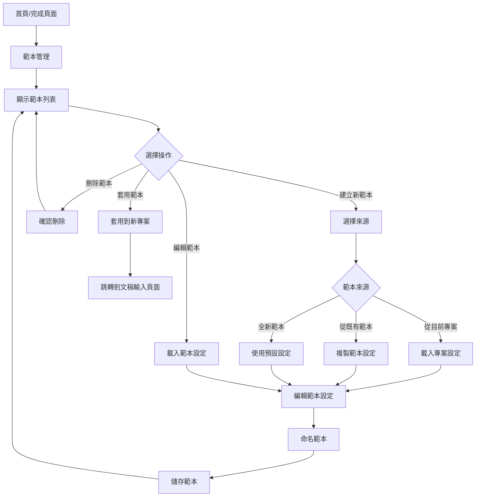

# 範本管理流程 (Template Management Flow)

## 流程概述

允許使用者建立、編輯、刪除和套用範本,儲存常用的影片設定以便快速重複使用。

**範本包含的設定**:
- 圖片風格 (realistic, cute-illustration, chinese-classic, children)
- 字幕樣式 (位置、字型、顏色、陰影等)
- Logo 設定 (若有)
- D-ID 對嘴設定 (是否啟用、位置)

**不包含**:
- 文稿內容
- 語音選擇 (每次製作時可能不同)
- YouTube 影片資訊

## 流程圖



## 詳細流程

### 1. 開啟範本管理

**觸發位置**:
- 首頁快速動作: [管理範本] 按鈕
- 完成頁面: [儲存為範本] 按鈕
- 腳本編輯頁面: 設定面板中的「範本」下拉選單旁的 [管理範本] 按鈕

**顯示範本管理對話框**:
```
┌─────────────────────────────────────────────────────────────┐
│  範本管理                                             [✕]    │
├─────────────────────────────────────────────────────────────┤
│  ┌─────────────────────────────┐ ┌─────────────────────────┐│
│  │ 我的範本 (3)         [+ 新增]│ │ 預覽                     ││
│  ├─────────────────────────────┤ ├─────────────────────────┤│
│  │ ● 我的預設樣式              │ │ 範本名稱:                ││
│  │   建立於 2025-10-15         │ │ 我的預設樣式             ││
│  │   [編輯] [刪除]             │ │                         ││
│  ├─────────────────────────────┤ │ 圖片風格:                ││
│  │ ○ 教學影片範本              │ │ 可愛插畫風格             ││
│  │   建立於 2025-10-20         │ │                         ││
│  │   [編輯] [刪除]             │ │ 字幕設定:                ││
│  ├─────────────────────────────┤ │ • 位置: 下方置中         ││
│  │ ○ 產品介紹範本              │ │ • 字型: PingFang TC     ││
│  │   建立於 2025-10-25         │ │ • 大小: 32px            ││
│  │   [編輯] [刪除]             │ │ • 顏色: 白色 (#FFFFFF)  ││
│  └─────────────────────────────┘ │ • 陰影: 黑色 (#000000)  ││
│                                   │                         ││
│                                   │ Logo:                   ││
│                                   │ 已設定                  ││
│                                   │                         ││
│                                   │ D-ID 對嘴:              ││
│                                   │ 不使用                  ││
│                                   └─────────────────────────┘│
│                                                               │
│                                          [關閉] [套用範本]    │
└─────────────────────────────────────────────────────────────┘
```

### 2. 建立新範本

**點擊「+ 新增」按鈕**:

**顯示範本來源選擇對話框**:
```
┌─────────────────────────────────────────────┐
│  建立新範本                              [✕] │
├─────────────────────────────────────────────┤
│  選擇範本設定來源                           │
│                                             │
│  ◉ 從目前專案建立                          │
│     使用目前專案的設定作為範本              │
│                                             │
│  ○ 複製既有範本                            │
│     從既有範本複製並修改                    │
│                                             │
│  ○ 建立全新範本                            │
│     從預設設定開始建立                      │
│                                             │
├─────────────────────────────────────────────┤
│                            [取消] [下一步 →] │
└─────────────────────────────────────────────┘
```

**方式 1: 從目前專案建立**

1. **前置條件**: 必須在專案編輯過程中 (文稿輸入後)
2. **載入設定**:
   - 圖片風格
   - 字幕樣式
   - Logo 設定 (包含位置和縮放)
   - D-ID 設定
3. **跳轉到範本編輯器**

**方式 2: 複製既有範本**

1. **顯示範本選擇列表**:
   ```
   ┌─────────────────────────────────────────┐
   │  選擇要複製的範本                    [✕] │
   ├─────────────────────────────────────────┤
   │  ◉ 我的預設樣式                         │
   │  ○ 教學影片範本                         │
   │  ○ 產品介紹範本                         │
   ├─────────────────────────────────────────┤
   │                        [取消] [確定]    │
   └─────────────────────────────────────────┘
   ```
2. **載入選中範本的設定**
3. **跳轉到範本編輯器**

**方式 3: 建立全新範本**

1. **使用預設設定**:
   - 圖片風格: realistic
   - 字幕位置: bottom-center
   - 字型: PingFang TC
   - 字體大小: 32px
   - 文字顏色: #FFFFFF
   - 陰影顏色: #000000
   - Logo: 未設定
   - D-ID: 不啟用
2. **跳轉到範本編輯器**

### 3. 範本編輯器

**顯示範本編輯對話框**:
```
┌─────────────────────────────────────────────────────────────┐
│  編輯範本                                             [✕]    │
├─────────────────────────────────────────────────────────────┤
│  範本名稱 *                                                  │
│  ┌──────────────────────────────────────────────────────┐   │
│  │ 我的預設樣式                                          │   │
│  └──────────────────────────────────────────────────────┘   │
│                                                               │
│  ┌───────────────────────────────────────────────────────┐  │
│  │  圖片風格                                              │  │
│  │  ◉ 真實攝影風格  ○ 可愛插畫風格                       │  │
│  │  ○ 中國古典風格  ○ 兒童繪本風格                       │  │
│  └───────────────────────────────────────────────────────┘  │
│                                                               │
│  ┌───────────────────────────────────────────────────────┐  │
│  │  字幕設定                                              │  │
│  │  位置 ▼ [下方置中]                                    │  │
│  │  字型 ▼ [PingFang TC]                                 │  │
│  │  字體大小 [32] px                                     │  │
│  │  文字顏色 ⬜ [#FFFFFF]                                │  │
│  │  陰影顏色 ⬛ [#000000]                                │  │
│  │                                                         │  │
│  │  ▸ 進階選項 (邊框、底色...)                           │  │
│  └───────────────────────────────────────────────────────┘  │
│                                                               │
│  ┌───────────────────────────────────────────────────────┐  │
│  │  Logo 設定                                             │  │
│  │  ☐ 包含 Logo 在範本中                                 │  │
│  │  (勾選後,每次套用範本時會使用相同的 Logo)              │  │
│  │                                                         │  │
│  │  [上傳 Logo]                                           │  │
│  └───────────────────────────────────────────────────────┘  │
│                                                               │
│  ┌───────────────────────────────────────────────────────┐  │
│  │  D-ID 對嘴設定                                         │  │
│  │  ◉ 不使用  ○ 僅片頭  ○ 僅片尾  ○ 片頭片尾都用         │  │
│  └───────────────────────────────────────────────────────┘  │
│                                                               │
│                                          [取消] [儲存範本]    │
└─────────────────────────────────────────────────────────────┘
```

**欄位說明**:

**範本名稱**:
- 必填
- 1-50 字
- 不可與既有範本重複

**圖片風格**:
- 單選按鈕
- 預設: realistic

**字幕設定**:
- 與影片預覽頁面相同的設定選項
- 可展開進階選項

**Logo 設定**:
- 可選是否包含 Logo
- 若包含,需上傳 Logo 圖片
- 儲存 Logo 圖片位置和設定

**D-ID 對嘴設定**:
- 單選按鈕
- 不包含人像圖片 (每次套用時上傳)

### 4. 儲存範本

**點擊「儲存範本」按鈕**:

1. **驗證**:
   - 範本名稱不為空
   - 範本名稱不重複 (若重複,詢問是否覆蓋)

2. **儲存檔案**:
   - 位置: `~/Library/Application Support/YTMaker3/templates/`
   - 檔名: `{template-id}.template.json`
   - 格式: 見 internal-data-contracts.yaml 中的 TemplateFile

3. **複製 Logo 檔案** (若有):
   - 從原始位置複製到範本目錄
   - 路徑: `~/Library/Application Support/YTMaker3/templates/logos/{template-id}.png`

4. **更新範本列表**:
   - 重新載入範本列表
   - 選中新建立的範本

5. **顯示成功提示**:
   - "範本已儲存"
   - 3 秒後自動消失

### 5. 編輯既有範本

**點擊範本列表中的「編輯」按鈕**:

1. **載入範本設定**:
   - 讀取範本 JSON 檔案
   - 填入範本編輯器

2. **允許修改**:
   - 可修改所有設定
   - 範本名稱可修改 (但不可與其他範本重複)

3. **儲存變更**:
   - 覆蓋原始範本檔案
   - 顯示成功提示: "範本已更新"

### 6. 刪除範本

**點擊範本列表中的「刪除」按鈕**:

**顯示確認對話框**:
```
┌─────────────────────────────────────────┐
│  確認刪除                            [✕] │
├─────────────────────────────────────────┤
│  確定要刪除範本「我的預設樣式」嗎?      │
│                                         │
│  此操作無法復原。                       │
├─────────────────────────────────────────┤
│                        [取消] [確認刪除] │
└─────────────────────────────────────────┘
```

**若確認刪除**:
1. 刪除範本 JSON 檔案
2. 刪除關聯的 Logo 圖片 (若有)
3. 從範本列表中移除
4. 顯示成功提示: "範本已刪除"

### 7. 套用範本

**方式 1: 從範本管理對話框套用**

1. **選擇範本**:
   - 點擊範本列表中的範本項目
   - 右側預覽面板顯示範本設定

2. **點擊「套用範本」按鈕**:
   - 若在專案中: 套用到目前專案
   - 若在首頁: 建立新專案並套用範本

**方式 2: 從新專案流程套用**

1. **在文稿輸入頁面**:
   - 右側設定面板顯示「範本」下拉選單
   - 選擇範本後自動套用設定

2. **在腳本編輯頁面**:
   - 右側設定面板顯示「範本」下拉選單
   - 選擇範本後套用圖片風格和 D-ID 設定

3. **在影片預覽頁面**:
   - 字幕設定面板顯示「範本」下拉選單
   - 選擇範本後套用字幕和 Logo 設定

**方式 3: 從批次製作套用**

1. **在批次製作設定頁面**:
   - 批次設定區塊顯示「範本」下拉選單
   - 選擇範本後套用到所有批次專案

**套用行為**:
- 載入範本的所有設定
- 覆蓋目前專案的相應設定
- 顯示提示: "已套用範本「{範本名稱}」"
- 若範本包含 Logo,複製 Logo 到專案目錄

## 範本檔案格式

**儲存位置**: `~/Library/Application Support/YTMaker3/templates/`

**檔案結構**:
```
templates/
├── {template-id-1}.template.json
├── {template-id-2}.template.json
├── {template-id-3}.template.json
└── logos/
    ├── {template-id-1}.png
    └── {template-id-2}.png
```

**JSON 格式** (見 internal-data-contracts.yaml):
```json
{
  "templateId": "a1b2c3d4-e5f6-7890-abcd-ef1234567890",
  "templateName": "我的預設樣式",
  "createdAt": "2025-10-29T15:00:00Z",
  "settings": {
    "imageStyle": "cute-illustration",
    "subtitleStyle": {
      "position": "bottom-center",
      "fontFamily": "PingFang TC",
      "fontSize": 32,
      "textColor": "#FFFFFF",
      "shadowColor": "#000000"
    },
    "logoSettings": {
      "enabled": true,
      "imagePath": "~/Library/Application Support/YTMaker3/templates/logos/a1b2c3d4.png",
      "position": { "x": 100, "y": 50 },
      "scale": 1.0
    }
  }
}
```

## 功能特點

### 1. 快速套用
- 一鍵套用所有設定
- 減少重複設定時間
- 適合製作系列影片

### 2. 彈性修改
- 套用後仍可調整
- 範本作為起點,不鎖定設定
- 修改後可另存為新範本

### 3. 範本預覽
- 即時預覽範本設定
- 避免套用錯誤範本
- 清楚顯示所有設定細節

### 4. 範本匯入/匯出 (未來功能)
- 匯出範本為檔案
- 分享給其他使用者
- 匯入他人的範本

## 鍵盤快捷鍵

```
Cmd+T: 開啟範本管理
Cmd+N: 建立新範本 (在範本管理中)
Cmd+S: 儲存範本 (在範本編輯器中)
Delete: 刪除選中的範本 (需確認)
Esc: 關閉範本管理
```

## 無障礙

- 範本列表支援鍵盤導航
- 所有設定支援 Tab 鍵切換
- 刪除操作需要明確確認
- Focus 樣式清晰可見
- 預覽面板提供完整文字描述
